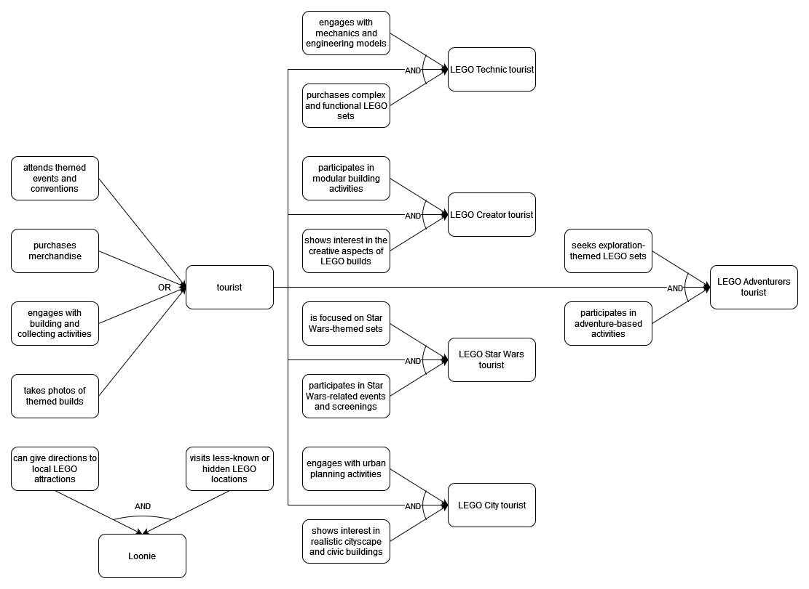

# FCIM.FIA - Fundamentals of Artificial Intelligence

## Lab 1: Expert (hopefully) Systems
## Performed by: Iațco Sorin, group FAF-213
## Verified by: Elena Graur, asist. univ.

----

## Imports and Utils
```python
from rules import LEGO_TOURIST_RULES, LEGO_TOURIST_DATA
from questions import mainMenu
from production import forward_chain, backward_chain 
```

## Implementation Description

### Task 1
I have defined 5 types of Luna-City tourists, being: 
1. LEGO Technic tourist
2. LEGO Creator tourist
3. LEGO Star Wars tourist
4. LEGO City tourist
5. LEGO Adventurers tourist

And there is another category which is Loonie, meaning NOT a tourist.

I have defined 4 facts to determine if it falls in the category of a tourist, if one of these facts is true then the person is in fact a tourist. For each individual category of tourists I added 2 facts both of which need to be true and the tourist state to be true. For Loonie I have 2 facts, both of which need to be true, but it can arrive here just if it is confirmed that the person declines each tourist fact.

So, finally I have represented my Goal Tree: 



### Task 2
Using the already implemented IF, AND, THEN rules I have implemented my tourist rules as following:

```python
LEGO_TOURIST_RULES = (
    IF( AND( '(?x) attends themed events and conventions' ),                    # L1
        THEN( '(?x) is a tourist' )),

    IF( AND( '(?x) purchases merchandise' ),                                    # L2
        THEN( '(?x) is a tourist' )),

    IF( AND( '(?x) engages with building and collecting activities' ),          # L3
        THEN( '(?x) is a tourist' )),

    IF( AND( '(?x) takes photos of themed builds' ),  
        THEN( '(?x) is a tourist' )),
    
    IF( AND( '(?x) is a tourist',                                               # L4                                  
             '(?x) engages with mechanics and engineering models',               
             '(?x) purchases complex and functional LEGO sets' ), 
        THEN( '(?x) is a LEGO Technic tourist' )),
        ...
)
```

### Task 3
This is an example of an output by the `forward_chain` algorithm from the provided code for my rules and an example dataset. 

```python
('joe attends themed events and conventions', 'joe engages with mechanics and engineering models', 'joe is a LEGO Technic tourist', 'joe is a tourist', 'joe purchases complex and functional LEGO sets')
```

### Task 4
Using a set of rules, this method applies a backward chaining to check a provided hypothesis in order to confirm or deny it. The function begins with a hypothesis and looks for rules where the hypothesis and the rule's consequent match using the implemented `match()` function. The procedure continues until a match is discovered, at which point the first antecedent of that rule becomes the new hypothesis and the rest of the facts are added to the `result` list, the process is repeated recursively. 

The algorithm gathers antecedents to support the hypothesis and arranges it in a goal tree that is readable by humans. It stops and returns the formatted tree and accumulated data if no other match is found. This method finds supporting facts by chaining through the rules in reverse order from the hypothesis.

Here is the whole code with specific docstring and comments to support the explanation:

```python
def backward_chain(rules, hypothesis, verbose=False):
    """
    Outputs the goal tree from having rules and hypothesis, works like an "encyclopedia"
    This function attempts to find the necessary antecedents to support a given hypothesis by
    recursively applying rules until no further matching rules are found.
    
    Args:
        rules (list): A list of rule objects, where each rule has `antecedent()` and `consequent()` methods.
        hypothesis (str): The hypothesis we want to prove or explore.
        verbose (bool): If True, print detailed output (not currently used in this function).

    Returns:
        tuple: A tuple containing:
            - list: A list of facts that support the hypothesis.
            - str: A human-readable string that represents the goal tree.
    """

    # Initialize the utils to be used in the function
    result = list()
    name = hypothesis.split(" ")[0]
    humanReadableOutput = f"{hypothesis} who: \n"

    def lookFor(hypothesis, rules, humanReadableOutput):
        """
        Recursively searches for antecedents to support the given hypothesis using the provided rules.
        
        Args:
            hypothesis (str): The current hypothesis to prove.
            rules (list): The list of rule objects.
            humanReadableOutput (str): The current state of the human-readable output string.

        Returns:
            tuple: A tuple containing:
                - list: Updated list of facts that support the hypothesis.
                - str: Updated human-readable output string.
        """
        matchFound = False  # Flag to indicate if a matching was found between a rule consequent and the hypothesis.
        # Iterate through the consequent of each rule until finding a match.
        for rule in rules:
            for expr in rule.consequent():
                if match(expr, hypothesis): 
                    matchFound = True
                    newHypothesis = rule.antecedent()[0]    # Get the first antecedent of the rule to be the next search.
                    # Add all the antecedents without duplicates to the result list.
                    for antecedent_fact in rule.antecedent():
                        if antecedent_fact not in result: 
                            result.append(antecedent_fact)
                            # Format the output results to be human-readable.
                            humanReadableOutput += str(antecedent_fact.replace("(?x)", " ")) + "," "\n"
        # If no match (meaning there are no antecedents for the hypothesis) was found and there are no more rules to check, return the results.
        if not matchFound:
            print("No match found or no more rules to check.") 
            # Remove the last line(intermediary state) from the human-readable output because there are no antecedents to show for this state.
            humanReadableOutput = humanReadableOutput.splitlines()
            if humanReadableOutput:
                humanReadableOutput.pop()
            humanReadableOutput = "\n".join(humanReadableOutput)
            return result, humanReadableOutput
        # If a match was found, continue the search with the new hypothesis.
        humanReadableOutput += str(newHypothesis.replace("(?x)", name)) + " who" + ": \n"
        
        # Recursively call the function with the new hypothesis.
        return lookFor(newHypothesis, rules, humanReadableOutput) 
    
    result, humanReadableOutput = lookFor(hypothesis, rules, humanReadableOutput)                                 
    return result, humanReadableOutput
```

### Task 5
First of all I have implemented the multiple choice questions which are the first type to run, they check for all the tourist facts to identify if the person is a tourist or not, if it's not then it skips the next type of questions and get directly to yes/no questions to confirm if it is in fact a Loonie or not. If the person is a tourist it will go on to the next type of questions that are ranking questions.

The Multiple choice questions works by simply asking all the facts about a tourist and an option for none of them, if at least one of the facts is chosen then it is added to the `facts` list and returned, then it performs the `forward_chain` algorithm.

```python
def askMultipleChoiceQuestion(rules, name, result):
    """
    Asks a multiple-choice question to gather information about which activity the person (identified by 'name')
    engages in. Based on the user's selection, the function updates the facts (result) and applies forward 
    chaining to infer additional information.

    Args:
        rules (list): A list of rules in the expert system.
        name (str): The name of the person being evaluated.
        result (tuple): Current set of facts (answers provided so far).

    Returns:
        tuple: Updated facts after processing the user's selection.
    """
    
    # Display a multiple-choice question to the user
    print(f"\nWhich of the following activities does {name} engage in?")
    # List of available choices representing different activities
    choices = [
        "1. Attend themed events and conventions",
        "2. Purchase LEGO merchandise",
        "3. Engage in building and collecting LEGO sets",
        "4. Take photos of themed LEGO builds",
        "5. None of the above"
    ]
    # Print each choice for the user to select
    for choice in choices:
        print("\t" + choice)

    # Get and validate the user's response
    while True:
        try:
            # Ask user to input a number corresponding to their choice
            response = int(input(f"Choose the number corresponding to the action {name} performs (1-5): "))
            if response < 1 or response > 5:
                raise ValueError  # Raise an error if input is out of range
            break
        except ValueError:
            print("Invalid choice. Please enter a number between 1 and 5.")  # Handle invalid input

    # Assign a fact based on the user's selection
    if response == 1:
        fact = "(?x) attends themed events and conventions"
    elif response == 2:
        fact = "(?x) purchases merchandise"
    elif response == 3:
        fact = "(?x) engages with building and collecting activities"
    elif response == 4:
        fact = "(?x) takes photos of themed builds"
    else:
        fact = None  # If "None of the above" is selected, no fact is assigned
    # If a valid fact is generated, update the result with the new fact
    if fact:
        y = list(result)
        y.append(fact.replace("(?x)", name))
        result = tuple(y)
    # Apply forward chaining to update the result with any inferred facts
    result = forward_chain(rules, result)
    # Display the user's selected choice
    print(f"\nYou selected: {choices[response - 1].split('. ', 1)[1]}")

    return result
```
The next type of questions are the ranking questions. After the multiple choice type of questions determined that the person is a tourist the user is given the task to rank a list of activities from 1 to 5 (5 being the most points and 1 the minimal points). Based on how the user rank the activities the facts related to these activities are added in a `hypothesis` list in the corresponding order and in the facts `list` to do the `forward_chain` on those. This is done for later use in the last type of questions.

```python
def askRankingQuestion(rules, name, result):
    """
    Asks the user to rank a set of activities in terms of how often the person (identified by 'name')
    participates in them, using a 1-5 ranking system. Each ranking corresponds to a potential tourist type,
    and the function derives facts and hypotheses based on the user's input.

    Args:
        rules (list): A list of rules in the expert system.
        name (str): The name of the person being evaluated.
        result (tuple): Current set of facts (answers provided so far).

    Returns:
        tuple: Updated facts and a list of hypotheses based on the ranking input.
    """
    
    # Prompt user to rank the activities from 1 to 5
    print(f"\nRank the following activities in order of {name}'s attendance (5 = Most attended, 1 = Least attended):")
    # List of activities corresponding to different tourist types
    preferences = [
        "Engaging with mechanics and engineering models",
        "Participating in modular building activities",
        "Participating in Star Wars-related events and screenings",
        "Engaging with urban planning activities",
        "Participating in adventure-based activities"
    ]
    # Display the activities for the user to rank
    for i, preference in enumerate(preferences):
        print(f"\t{i + 1}. {preference}")
    rankings = {}  # Dictionary to store user's ranking
    hypothesis = []  # List to store hypotheses based on the rankings

    # Loop through each activity and get a ranking from the user
    for preference in preferences:
        while True:
            try:
                # Ask user to enter a rank between 1 and 5 for the current preference
                rank = int(input(f"Enter your rank for {preference} (1-5): "))
                if rank < 1 or rank > 5:
                    raise ValueError("Rank should be between 1 and 5.")
                if rank in rankings.values():
                    raise ValueError("Each rank must be unique.")  # Ensure no duplicate ranks
                rankings[preference] = rank  # Store the rank for this activity
                break
            except ValueError as e:
                print(e)  # Handle invalid input and prompt again

    # Sort the activities by their rankings (highest rank first)
    sorted_rankings = sorted(rankings.items(), key=lambda item: item[1], reverse=True)
    fact = []  # List to store facts derived from rankings

    # Loop through sorted preferences and assign facts and hypotheses
    for preference, rank in sorted_rankings:
        # Assign facts and hypotheses based on the ranked preferences
        if preference == "Engaging with mechanics and engineering models":
            fact.append("(?x) engages with mechanics and engineering models")
            hypothesis.append("(?x) is a LEGO Technic tourist")
        elif preference == "Participating in modular building activities":
            fact.append("(?x) participates in modular building activities")
            hypothesis.append("(?x) is a LEGO Creator tourist")
        elif preference == "Participating in Star Wars-related events and screenings":
            fact.append("(?x) participates in Star Wars-related events and screenings")
            hypothesis.append("(?x) is a LEGO Star Wars tourist")
        elif preference == "Engaging with urban planning activities":
            fact.append("(?x) engages with urban planning activities")
            hypothesis.append("(?x) is a LEGO City tourist")
        elif preference == "Participating in adventure-based activities":
            fact.append("(?x) participates in adventure-based activities")
            hypothesis.append("(?x) is a LEGO Adventurers tourist")
    # Add the derived facts to the result
    if fact:
        for element in fact:
            y = list(result)
            y.append(element.replace("(?x)", name))
            result = tuple(y)
    # Apply forward chaining to update the result with any inferred facts
    result = forward_chain(rules, result)
    # Display the user's rankings
    print("\nYour ranking:")
    for preference, rank in sorted_rankings:
        print(f"\t{preference}")

    return result, hypothesis  # Return the updated result and the list of hypotheses
```
Lastly there are the yes/no questions which confirms the specific type of tourist or Loonie or if the questions were answered in a different matter that it cannot identify the person. These questions work different for tourist types and for Loonie, for Loonie it asks all the facts recursively to confirm this type of person. For the tourist types though it iterates through the `hypothesis` list added earlier in the ranking questions based on their rankings. This is done to use as few questions as possible to get a tourist type.

```python
def askYesNoQuestion(rules, name, result, hypothesis):
    """
    Asks yes/no questions to gather additional facts based on the rules and current hypothesis.
    
    This function processes both single and multiple hypotheses, asking the user yes/no questions
    to confirm or deny conditions. It then updates the facts (result) based on the answers 
    and applies forward chaining to derive additional conclusions.

    Args:
        rules (list): A list of rules in the expert system.
        name (str): The name of the person being evaluated.
        result (tuple): Current set of facts (answers provided so far).
        hypothesis (str or list): The hypothesis (or list of hypotheses) being evaluated.

    Returns:
        tuple: Updated facts after processing user responses.
    """
    found = False  # Tracks if a conclusion is found based on the user's responses

    # Check if the hypothesis is a list (for multiple hypotheses)
    if isinstance(hypothesis, list):
        # Iterate through each specific hypothesis
        for specific_hypothesis in hypothesis:
            for rule in rules:
                # Check if the rule's consequent matches the hypothesis
                for statement in rule.consequent():
                    if statement == specific_hypothesis:
                        # Ask yes/no questions for each condition in the rule's antecedent
                        for condition in rule.antecedent():
                            # Skip conditions that are already in the result (already confirmed)
                            if condition.replace("(?x)", name) not in result:
                                print(condition.replace("(?x)", name) + "?")
                                while True:
                                    response = input("Enter 'yes' or 'no': ").lower()
                                    if response == "yes":
                                        # Update the result with the confirmed condition
                                        y = list(result)
                                        y.append(condition.replace("(?x)", name))
                                        result = tuple(y)
                                        # Apply forward chaining to derive additional facts
                                        result = forward_chain(rules, result)
                                        break
                                    elif response == "no":
                                        break
                                    else:
                                        print("Invalid input. Please enter 'yes' or 'no'.")
                                        continue
                                
                                # Check if a tourist type has been identified
                                for element in result:
                                    formatted = element.split(" ", 1)
                                    if len(formatted) > 1:
                                        element = f"(?x) {formatted[1]}"
                                    if element in touristTypes:
                                        print("\n " + "--- " + element.replace("(?x)", name) + " ---")
                                        found = True
                                        break
                            else:
                                continue  # Skip already known conditions
                if found:
                    break  # Stop further processing if a tourist type is found

    # Handle the case where the hypothesis is a single statement
    else:
        for rule in rules:
            for statement in rule.consequent():
                if statement == hypothesis:
                    # Ask yes/no questions for each condition in the rule's antecedent
                    for condition in rule.antecedent():
                        if condition.replace("(?x)", name) not in result:
                            print(condition.replace("(?x)", name) + "?")
                            while True:
                                response = input("Enter 'yes' or 'no': ").lower()
                                if response == "yes":
                                    # Update result with the confirmed condition
                                    y = list(result)
                                    y.append(condition.replace("(?x)", name))
                                    result = tuple(y)
                                    # Apply forward chaining to derive additional facts
                                    result = forward_chain(rules, result)
                                    break
                                elif response == "no":
                                    break
                                else:
                                    print("Invalid input. Please enter 'yes' or 'no'.")
                                    continue
                            
                            # Check if a tourist type has been identified
                            for element in result:
                                formatted = element.split(" ", 1)
                                if len(formatted) > 1:
                                    element = f"(?x) {formatted[1]}"
                                if element in touristTypes:
                                    print("\n " + "--- " + element.replace("(?x)", name) + " ---")
                                    found = True
                                    break
                        else:
                            continue  # Skip already known conditions
            if found:
                break  # Stop further processing if a tourist type is found

    # If no conclusion is reached, inform the user
    if not found:
        print(f"\nUnfortunately, I don't have enough information to determine who {name} is.")
    
    return result
```

### Task 6
The `mainMenu` function is used to coordinate all the methods and their specific order. It has the option to give a hypothesis and test the `backward_chain` algorithm specifically or to answer questions to identify the person. The `forward_chain` algorithm is used in the question types algorithms in order to get the tourist type. The questions and the output are formatted in a human readable format and respect grammatical rules of the English language. There is also input validation in order to work with the correct data and for error handling.  

Here is an example:
```
==========================
LEGO Tourist Expert System   
==========================

Welcome! In this system, I'll help identify who your person is.

Press 1 to give a hypothesis or Press 2 to answer questions: 2
Enter a name to start: Joe

Which of the following activities does Joe participate in?
        1. Attend themed events and conventions
        2. Purchase LEGO merchandise
        3. Engage in building and collecting LEGO sets
        4. Take photos of themed LEGO builds
        5. None of the above
Choose the number corresponding to the action Joe performs (1-5): 2

You selected: Purchase LEGO merchandise

Rank the following activities in order of Joe's attendance (5 = Most attended, 1 = Least attended):
        1. Engaging with mechanics and engineering models
        2. Participating in modular building activities
        3. Participating in Star Wars-related events and screenings
        4. Engaging with urban planning activities
        5. Participating in adventure-based activities
Enter your rank for Engaging with mechanics and engineering models (1-5): 4
Enter your rank for Participating in modular building activities (1-5): 3
Enter your rank for Participating in Star Wars-related events and screenings (1-5): 2
Enter your rank for Engaging with urban planning activities (1-5): 4
Each rank must be unique.
Enter your rank for Engaging with urban planning activities (1-5): 5
Enter your rank for Participating in adventure-based activities (1-5): 1

Your ranking:
        Engaging with urban planning activities
        Engaging with mechanics and engineering models
        Participating in modular building activities
        Participating in Star Wars-related events and screenings
        Participating in adventure-based activities
Joe shows interest in realistic cityscape and civic buildings?
Enter 'yes' or 'no': no
Joe purchases complex and functional LEGO sets?
Enter 'yes' or 'no': yes

 --- Joe is a LEGO Technic tourist ---

============================
Thank you for participating!
============================
```

```python
def mainMenu():
    """
    Displays the main menu of the Expert System and manages user input for 
    either hypothesis-driven identification or answering questions to identify a LEGO tourist.

    Users can choose to either input a hypothesis or answer a series of multiple-choice and yes/no questions
    to identify a LEGO tourist.
    
    Returns:
        result: The outcome of the expert system's evaluation based on the input (a conclusion about the tourist type).
    """
    print("\n==========================")
    print("LEGO Tourist Expert System")
    print("==========================\n")
    
    print("Welcome! In this system, I'll help identify who your person is.\n")

    # Continuously prompt user until they provide valid input (1 or 2)
    while True:
        inputChoice = input("Press 1 to give a hypothesis or Press 2 to answer questions: ")
        if inputChoice == "1" or inputChoice == "2":
            break
        else:
            print("Invalid input. Please enter '1' or '2'.")

    # Handle user selection for hypothesis or question-answering
    if inputChoice == "1":
        # Hypothesis-driven approach: prompt user to enter a hypothesis
        hypothesis = input("Enter a hypothesis in the format \"{name} is a LEGO Technic tourist\": ")
        result, humanReadable = backward_chain(LEGO_TOURIST_RULES, hypothesis)
        print(humanReadable)
    elif inputChoice == "2":
        # Question-driven approach: ask the user for a name and proceed with multiple-choice questions
        while True:
            name = input("Enter a name to start: ")
            if name == "":
                print("Name cannot be empty. Please enter a valid name.")
                continue
            else:
                break
        # Initialize an empty set of facts to track user responses
        facts = ()
        # Ask multiple-choice questions to gather initial facts
        facts = askMultipleChoiceQuestion(LEGO_TOURIST_RULES, name, facts)
        # If facts were collected, proceed with ranking question; otherwise, default to a Loonie hypothesis
        if facts:
            facts, hypothesis = askRankingQuestion(LEGO_TOURIST_RULES, name, facts)
        else:
            hypothesis = "(?x) is a Loonie"  # Default hypothesis if no facts were gathered
        # Ask yes/no questions based on the gathered facts and hypothesis to refine the tourist identification
        result = askYesNoQuestion(LEGO_TOURIST_RULES, name, facts, hypothesis)

    print("\n============================")
    print("Thank you for participating!")
    print("============================\n")

    return result

```

## Conclusions
In summary, in this laboratory work I managed to implement an expert system to identify tourist types in an imaginary city Luna-City. I implemented the backward_chain algorithm to have both forward and backward traversion of the Goal Tree. I was able to gain knowledge about this basic system that will serve as a fundamental for further learning in this course.

Finally, implementing all the theoretical knowledge into working python code got me hands on experience with this type of systems and helped me to understand how I can integrate such algorithms to resolve these types of problems.

## Bibliography
- [Docstrings](https://www.geeksforgeeks.org/python-docstrings/)
- [Goal Trees](https://www.youtube.com/watch?v=leXa7EKUPFk&list=PLUl4u3cNGP63gFHB6xb-kVBiQHYe_4hSi&index=5)
- [Diagram Tool](https://app.diagrams.net/)

## Credits
Helped by Gutu Dinu FAF-213.